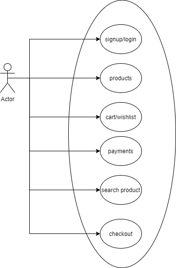
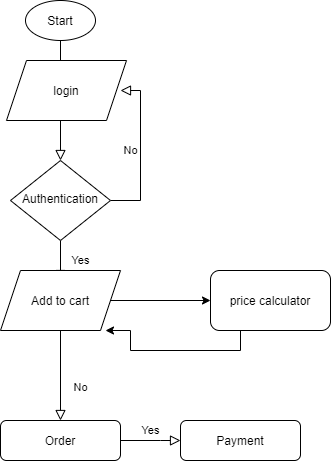
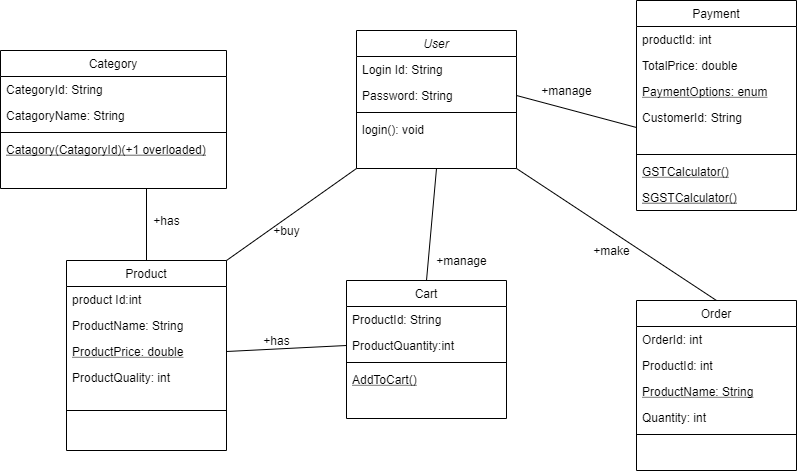

DemoKart

**Project Title:**

Shopping Cart

**Project Purpose:**

Shopping cart is a E commerce site to facilitate the customer to buy the products online. The customers will select the products listed to buy, add them into a cart, places the orders and make the payments.

**Project Scope:**

- Any member can register and view products and can filter based on Category.
- Customer can search any product with the name of the product and the product code.
- The scope of this project is to facilitate the users to provide the proper user experience.
- The facilities for the user is to place order according to the choice of the project.
- The user can have multiple addresses like shipping and billing. During checkout, the user can chouse the address according to their choice
- In this system only product choice is to handled and the product were added into the cart for the checkout by completing the payment process.

Project Goal

- Better UI experience
- Customer Satisfaction
- Track Customer orders

**SWOT analysis**

|***Strengths***|***Weaknesses***|***Opportunities***|***Threats***|
| - | - | - | - |
|
1. The selective and expansive scope of items.

2. Own payment gateway & logistic arm.

3. Security
|
1. Limited distributed channel reach

2. Cost of Acquisition

3. Power in the hand of buyers
|
1. Expansion of business

2. Expanding their product categories

3. Supply chain

|
1. Competition

2. Government Regulations.
|

Use Case Diagram

Flow Chart

Class Diagram

